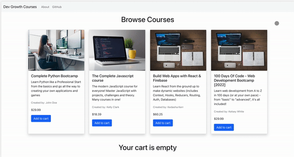

# DevGrowthCourses

Dev Growth Courses is an e-Commerce platform for developers to buy technical courses

The **frontend** of the application is built using React and reactstrap/bootstrap for simple styling. I leveraged the npm package [react-use-cart](https://www.npmjs.com/package/react-use-cart) to create a simple shopping cart - this made it easy to implement adding, updating and deleting items from a cart.

✨Yay to developers solving problems for other devs!✨

The **backend** was seamlessly built using Strapi's headless CMS. I was able to get my node app up and running in under 20mins! 😌

[Check it out for yourself](https://strapi.io/).

### App Demo

## Getting Started Locally

1. Clone the repository to your local machine

### BackEnd

1. `Cd` into the [strapi-api](https://github.com/LadyKerr/DevGrowthCourses/tree/main/strapi-api)
1. Run `npm install` to download all dependencies.
1. Start a localhost served version with `npm run develop`.
1. Once NPM does its thing, go to `http://localhost:1337/courses` to see a list of courses.

### FrontEnd

1. `Cd` into the [react-client](https://github.com/LadyKerr/DevGrowthCourses/tree/main/react-client)
1. Run `npm install` to download all dependencies.
1. Start a localhost served version with `npm run start`.
1. Once NPM does its thing, go to `http://localhost:3000/` to see your local copy of the React app.

### Features

- view a list of currently available courses for sale
- add courses to cart
- remove course from cart
- update quantity in the cart

### Future implementation

- integrate Stripe API for checkout page
- ship shopping cart on a seperate page (add react router)

### Swagger Docs

link: `http://localhost:1337/documentation/v1.0.0#/`
